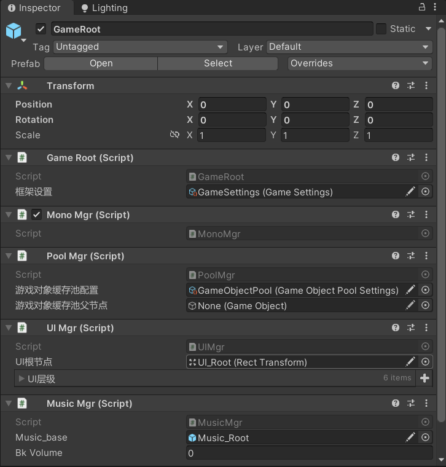

# AE_Framework

**使用本框架之前你要做**

1. 在场景下挂载GameRoot,(预制体在Prafab文件夹下)

2. 在Addressable里添加资源"AudioSource",(预制体在Prafab文件夹下)

3. 在框架窗口的对象池里添加AudioSource的Addressable引用

4. 你可以为PoolMgr创建对象池父节点,也可以等待PoolMgr自己创建

5. 确保GameRoot下有如下组件:

   